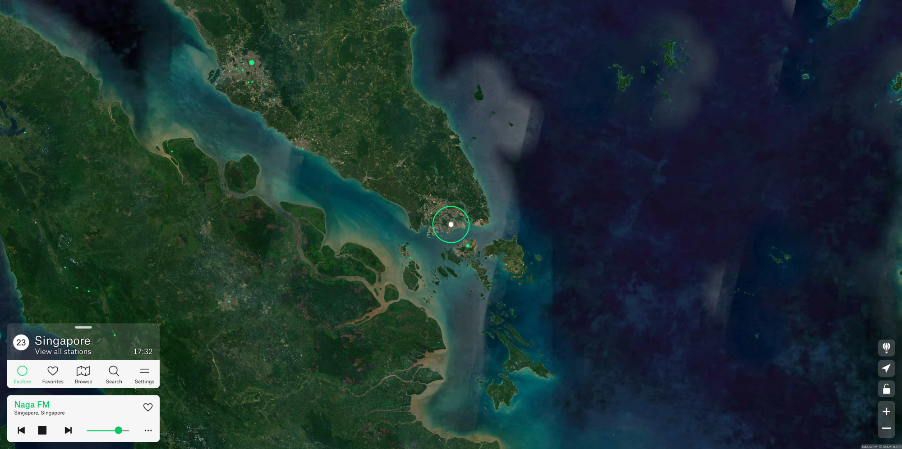
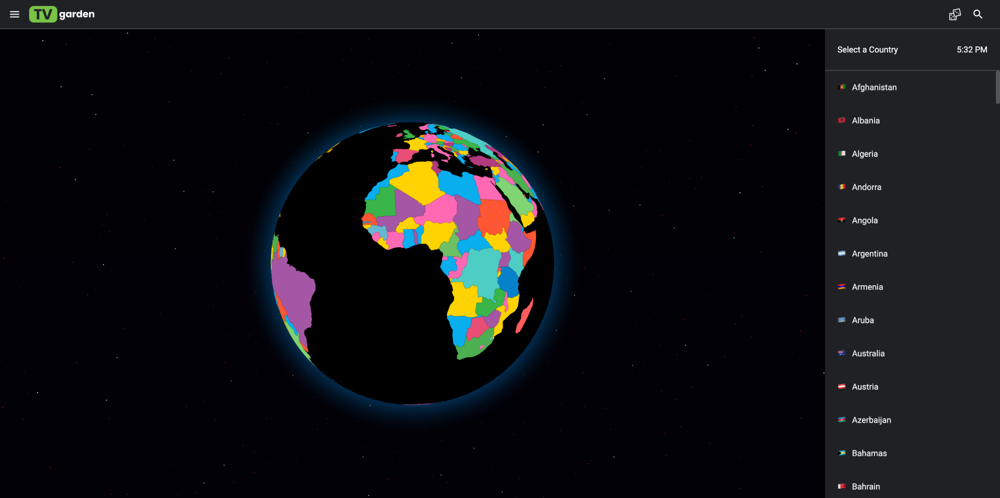
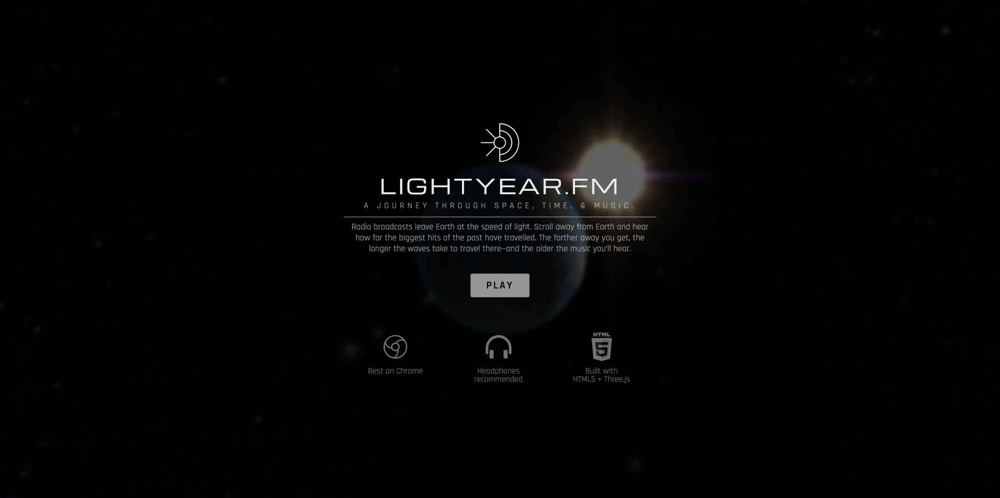

### Radio Garden：在地球上聆听全球广播电台

##### https://radio.garden/

Radio Garden 是一个令人惊叹的交互式全球电台网站，由位于荷兰的非营利组织开发的收音机和数字研究计划。该项目由荷兰声音与视觉研究所于2013年至2016年间开发，与跨国收音机知识平台和多所欧洲大学合作完成。它将世界各地超过8,000个广播电台以地理位置的方式呈现在一个3D地球模型上。你可以旋转地球，点击任何一个绿点，就能立即收听该地区的本地广播电台。无论是想听巴黎的法语新闻、东京的J-Pop音乐，还是纽约的脱口秀节目，只需要转动地球找到对应的城市即可。这个网站的理念是"打破收音机的界限"，让你足不出户就能体验全球各地的广播文化。

---

### TV Garden：探索全球电视频道

##### https://tv.garden/

TV Garden 是一个全球电视频道聚合网站，汇集了世界各地的电视频道，让用户可以浏览和观看来自不同国家和地区的电视节目。通过直观的地理界面，你可以探索各个国家的电视文化，了解不同地区的节目内容和制作风格。无论是新闻、体育、娱乐还是纪录片，TV Garden 都能让你体验到全球电视的多样性和丰富性。

---

### My Retro TVs：美国经典电视节目模拟器

##### https://www.myretrotvs.com/

My Retro TVs 是一个独特的怀旧网站，它完美还原了各个年代经典电视机的外观和观看体验。网站提供了从20世纪50年代到90年代各个时期的电视机模型，包括黑白电视、彩色CRT电视等。你可以选择不同的电视机型号，观看经过特殊处理的视频内容，体验那个年代特有的画面质感、扫描线、色彩风格和电视雪花。需要说明的是，网站主要展示的是美国经典电视节目内容（包括情景喜剧、电视剧等），中文用户可能对节目内容本身不太感兴趣，但可以通过这个网站体验不同年代电视机的视觉效果和怀旧氛围，了解过去的视听技术演变。

---

### TV HzFE：电视频率体验

##### https://tv.hzfe.org/

TV HzFE 是一个专注于电视技术和频率的实验性网站。它提供了一种独特的方式来体验电视信号和频率相关的视听效果。网站可能包含各种电视测试图案、色彩校准工具，以及模拟传统模拟电视信号的效果。对于技术爱好者和怀旧者来说，这个网站提供了深入了解电视广播技术演变的机会，让用户可以探索从模拟到数字时代电视技术的发展历程。

---

### Lightyear.fm：时光广播电台

##### https://www.lightyear.fm/

Lightyear.fm 是一个充满诗意和科幻色彩的广播网站。它的理念基于一个有趣的物理概念：光年。网站让你选择距离地球不同光年距离的位置，然后播放对应年份的广播节目。例如，如果你选择距离地球40光年的位置，你将听到40年前的广播内容，仿佛这些电波刚刚传播到那个距离。这个创意将时间、空间和音频完美结合，不仅是一个怀旧工具，更是一个让人思考时空概念的哲学体验。通过这个网站，你可以"回到过去"，聆听不同年代的音乐、新闻和文化，感受时光的流逝。

*点击下方按钮发现更多有趣网站。*

