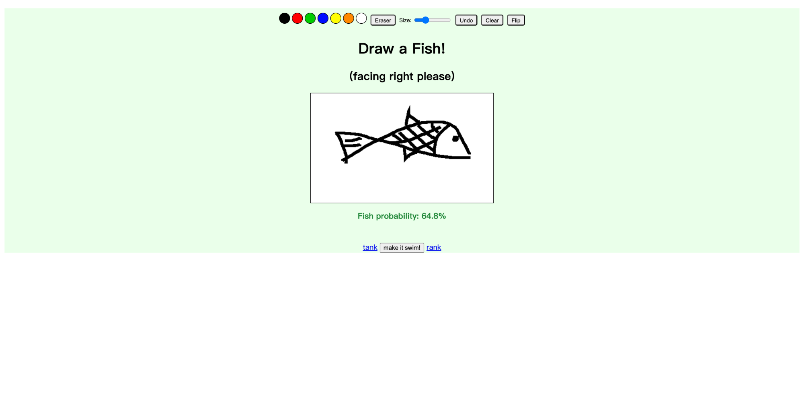
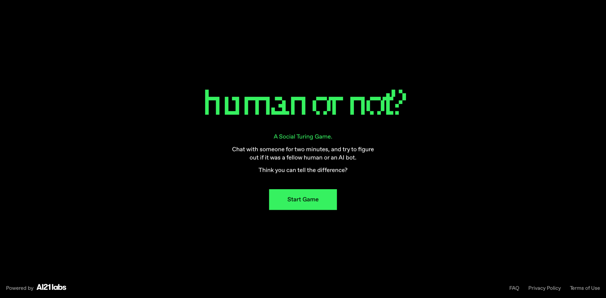
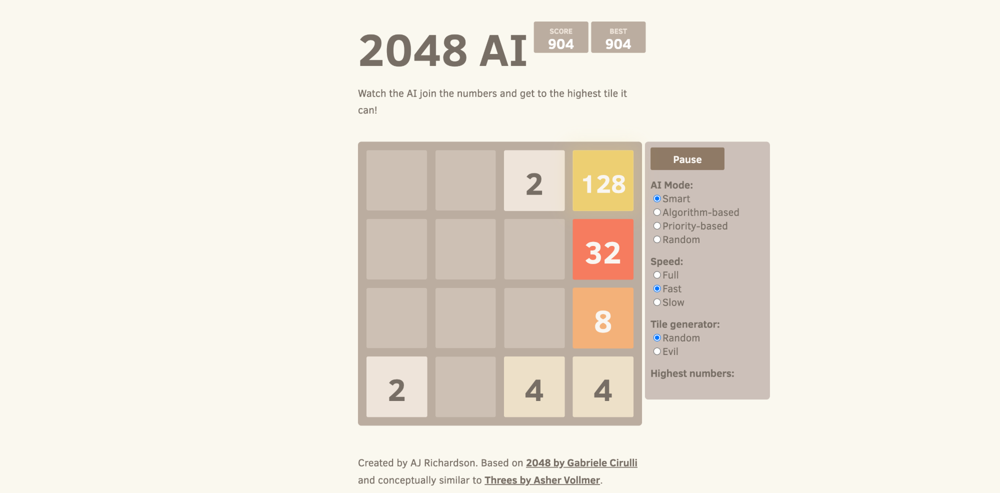

### [This Person Does Not Exist：AI生成不存在的人](https://thispersondoesnotexist.com/)

This Person Does Not Exist 是一个基于 StyleGAN 技术的AI应用网站，它可以生成完全虚构的人脸照片。每次刷新页面，都会显示一张全新的、现实中不存在的人脸图像。这些照片涵盖了不同年龄、种族和表情，展现出较高的真实度。该项目展示了生成对抗网络(GAN)在图像生成领域的应用能力，也引发了人们对AI时代"真实性"概念的思考。

---

### [Draw a Fish：手绘一条鱼，让AI判断你画得好不好](https://drawafish.com/)

Draw a Fish 是一个互动式AI网站，用户可以在画布上绘制一条鱼，然后由AI对作品进行评分和点评。无论绘画水平如何，AI都会提供相应的反馈。该网站结合了图像识别技术，让用户在娱乐的同时体验AI的评价能力。这个应用展示了AI在艺术评价领域的应用可能性。

---

### [Human or Not：判断你对话的是人类还是AI](https://www.humanornot.ai/)

Human or Not 是一个现代版的图灵测试网站。用户会进行一段简短的文字聊天，然后需要判断对方是真人还是AI。随着ChatGPT等大语言模型的发展，AI的对话能力已经接近人类水平，有时确实难以分辨。该网站让用户体验AI技术的进步水平，同时也是一个社交实验项目。

---

### [2048 AI：看AI如何玩转2048游戏](https://aj-r.github.io/2048-AI/)

这个网站展示了AI如何玩2048游戏。网站提供了多种AI算法，用户可以选择不同的策略，观察AI如何逐步合并数字并追求高分。网站还支持让AI自动运行，记录其达到的分数。通过这个项目，可以了解不同的AI决策算法和博弈策略，适合对算法感兴趣的用户。

---

### [Flolife：用AI测试你的人生轨迹](https://flolife.me/)

Flolife 是一个AI生命模拟网站。用户可以输入一些个人信息和选择项，AI会生成一条可能的人生轨迹，包括职业发展、人际关系、重大事件等内容。该应用基于统计数据和AI推理进行模拟，虽然不能预测真实的未来，但可以展示不同选择可能带来的不同结果。

---

### [Pixel Art Generator：将任意图片转换成像素风格](https://pixelartgenerator.app/zh)

Pixel Art Generator 是一个将照片转换为像素画的AI工具。用户上传图片后，AI会自动将其转换成不同像素密度的像素艺术作品。该工具支持调整像素大小、颜色数量等参数，以创建复古风格的图像。这个应用适用于制作游戏素材、设计头像等多种用途。

---

### [Extraordinary Things：AI生成的奇异事物](https://extraordinarythings.co/)

Extraordinary Things 是一个展示AI创造力的艺术项目。该网站收集和展示了AI生成的各种奇异、有趣、甚至超现实的物品和场景。内容包括虚构的生物、梦幻般的建筑等元素，每件作品都是独特的AI创作。通过这个网站，可以看到AI在艺术创作领域的表现形式和创作能力。

*想要探索更多有趣的网站，点击下方按钮发现更多内容。*

