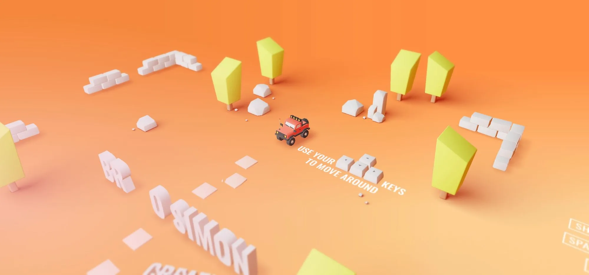
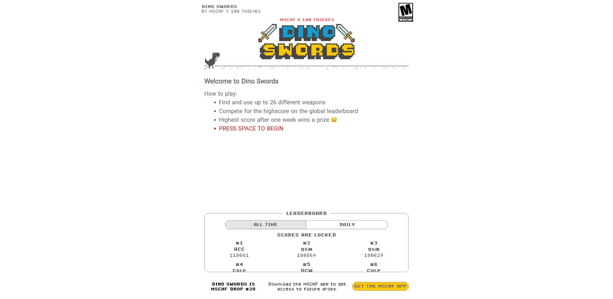

### [Bruno Simon: Online Remote Control Car](https://bruno-simon.com/)

Enter the site and you'll see a small car that you can control using the arrow keys on your keyboard. You can drive around recklessly in this virtual world. The overall effect of the website is amazing, making you feel like you're in a virtual world. You can freely explore this world, drive the car through various scenes, and experience the joy of gaming.

---

### [Cross Road Chicken Game](https://cross-road-eight.vercel.app/)

Cross Road Chicken 🐤 is a chicken crossing game implemented with Three.js. Players need to control the chicken to cross the road, avoiding oncoming vehicles and obstacles to safely reach the other side. If you like simple and fun mini-games, Cross Road Chicken 🐤 is definitely worth a try! Come challenge your reaction skills!

Note: Requires VPN access

---

### [PCOL Snooker: Play Snooker Online with AI](http://www.heyzxz.me/pcol/?from=w3cay.com)

This is an online snooker game that provides excellent graphics and realistic physics effects. Even people who don't know how to play pool will be attracted by the relaxed and elegant environment and try a game against AI. The website uses realistic physics engines and AI algorithms to let users experience the fun of snooker online. Whether you're a beginner or an expert, you can find challenges suitable for your skill level.

---

### [Free Web Version of Red Alert Game](https://ra2web.com/?from=w3cay.com)

This is a free web version of Red Alert where players can experience the classic Red Alert game in their browser. The game retains the original gameplay and graphics, allowing players to choose different factions for battles and experience the fun of real-time strategy.

---

### [Flappy Musk: Play and Earn Virtual Coins!](https://www.flappymusk.xyz/?from=w3cay.com)

Flappy Musk is a game based on the Polygon blockchain where players control a rocket to fly, avoid obstacles, and earn cryptocurrency rewards. The game's background is inspired by Tesla founder Elon Musk, aiming to showcase innovative and exciting gaming experiences to players.

---

### [Hyperbolic Sokoban: Non-Euclidean Space Box-Pushing Game](https://sokyokuban.com/?from=w3cay.com)

"Hyperbolic Sokoban" is a puzzle game based on hyperbolic geometry where players need to move blocks to designated positions on a hyperbolic plane. The game adopts a unique vaporwave aesthetic style, allowing players to enjoy wonderful visual experiences while solving puzzles. This game was created by a group of young people who love geometry and art, aiming to challenge players' logical thinking and spatial imagination.

---

### [Armed Dinosaur: Equip Your Dinosaur for the Parkour Journey!](https://dinoswords.gg)

"Armed Dinosaur" is an interesting parkour game where players control a small dinosaur running through various obstacles and collect items to enhance their abilities. The game features beautiful graphics and simple controls, suitable for players of all ages.

---

### [Blocks: Tangram-like Puzzle Game, Challenge Your Intelligence](https://blocks.ovh/?from=w3cay.com)

"Blocks" is a tangram-like puzzle game where players need to fill given areas by moving blocks of different shapes. The game rules are simple but challenging, suitable for exercising logical thinking and spatial imagination. Welcome to the challenge!

*Want to explore more weird websites? Click below button to discover more!*