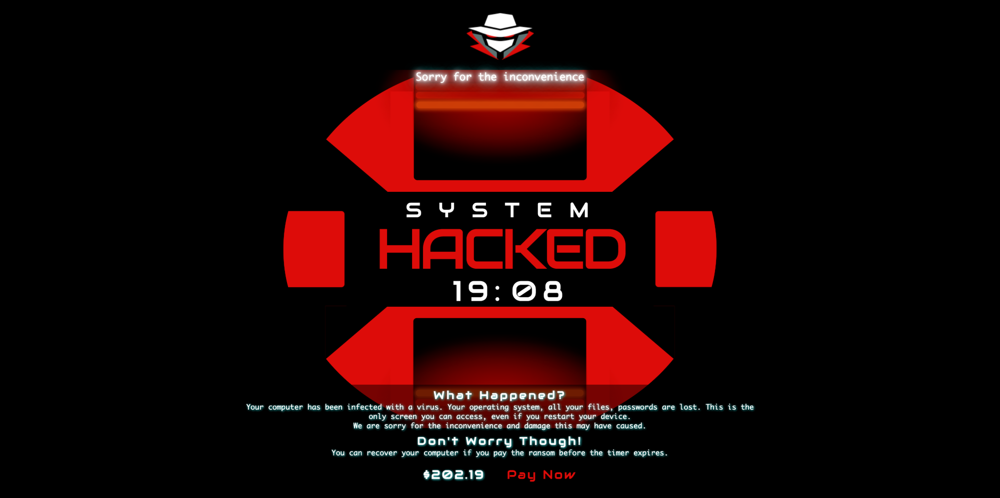

### Pranx Hacker: Classic Hacker Terminal Simulator

##### https://pranx.com/hacker/

Pranx Hacker is a classic geek-style prank website that perfectly simulates the classic interface of a hacker terminal. The website displays Matrix-style green code rain, system intrusion warnings, file scanning, password cracking, and other visual effects, creating a tense and exciting hacker invasion atmosphere. You can use it to prank colleagues or friends, creating a fun prank effect. Although this is just a visual effect, it's enough to make non-technical people feel nervous. This website showcases the charm of hacker aesthetics in geek culture and is a creative project beloved by technology enthusiasts. The website interface is beautifully designed with smooth animations, making it a classic geek prank tool.

---

### ertdfgcvb.xyz: Geek-Style Minimalist Website

##### https://ertdfgcvb.xyz/

ertdfgcvb.xyz is a geek-style minimalist website. The domain name itself is the arrangement of letters on the second row of the keyboard, reflecting geeks' pursuit of detail. This website showcases the minimalist aesthetics and creative expression in geek culture. The website design is simple yet creative, conveying the essence of geek culture through minimal elements. For technology enthusiasts and geeks, this website is not only an interesting discovery but also a tribute to the geek spirit. It proves that even the simplest website can convey profound cultural connotations through creativity and design.

---

### Kaspersky Cyberthreat Real-time Map: Global Cybersecurity Visualization

##### https://cybermap.kaspersky.com/

Kaspersky Cyberthreat Real-time Map is a geek-style data visualization website that displays the distribution of global cyber threats and cyber attacks in real-time. The website shows cyber attack activities around the world through an interactive map, including malware, phishing, DDoS attacks, and other types of threats. You can see detailed information about attack sources, targets, attack types, and more, with data updated in real-time, giving you an intuitive understanding of the current state of global cybersecurity. This tool is very valuable for cybersecurity researchers, technology enthusiasts, and geeks concerned about cybersecurity. The website displays the geographical distribution patterns of cyber threats, revealing the complexity of the cyber world and potential security issues.

---

### Hacked Screen: Hacker Invasion Prank Tool

##### https://hackedscreen.com/

Hacked Screen is a geek-style prank website that perfectly simulates the classic interface of a hacker invading a computer. The website displays system intrusion warnings, file scanning, password cracking, data breaches, and other visual effects, creating a tense and exciting hacker invasion atmosphere. You can use it to prank colleagues or friends, creating a fun prank effect. Although this is just a visual effect, it's enough to make non-technical people feel nervous. This website showcases the charm of hacker aesthetics in geek culture and is a creative project beloved by technology enthusiasts. The website interface is beautifully designed with smooth animations, making it a classic geek prank tool.

---

### Anon Blue: Customize Windows Blue Screen Interface

##### https://anon.blue

Anon Blue is a geek-style website that perfectly recreates the classic Windows Blue Screen of Death (BSOD) interface. You can customize error codes, error messages, technical parameters, and other content on the blue screen, then generate a personalized blue screen screenshot. This website is not only a tribute to Windows system history but also a way for geeks to showcase their creativity. You can use it to create fun prank images or as material for technical demonstrations. For geeks familiar with Windows systems, this website is full of nostalgia and technical humor. The website supports blue screen styles from multiple Windows versions, allowing you to create different styles of blue screen interfaces.

*Want to explore more interesting websites? Click below to discover more content.*

