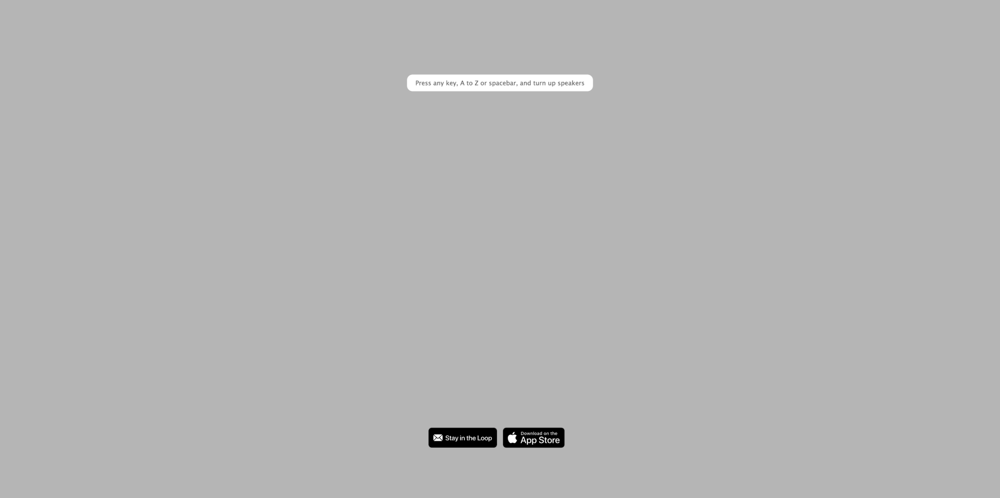
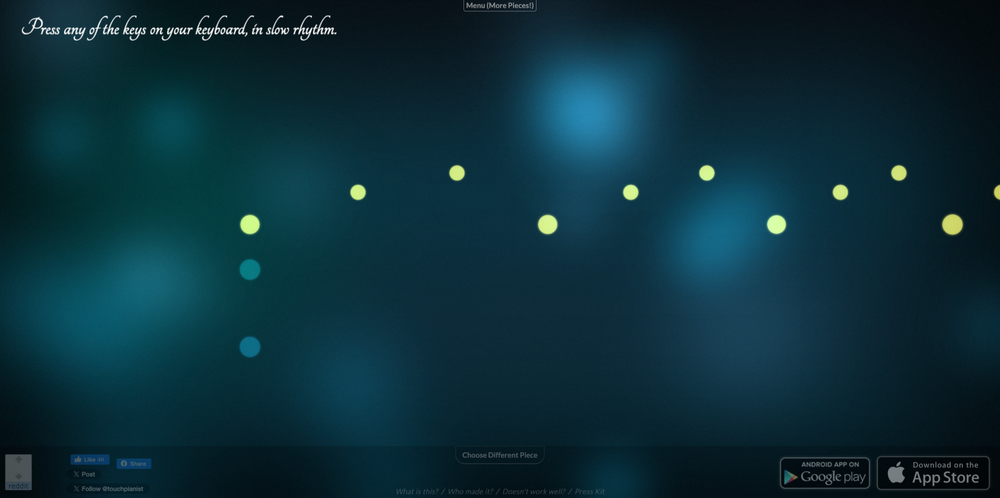
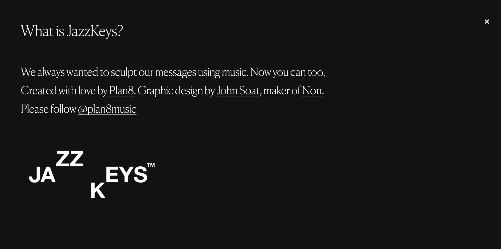

### A Number From the Ghost: Interactive Music Video Experience

##### [https://www.anumberfromtheghost.com/](https://www.anumberfromtheghost.com/)

A Number From the Ghost is a unique interactive music video website that perfectly combines music with interactive visual art. Users can trigger different music and animation effects through simple operations, experiencing unique musical interactions. This website demonstrates the new possibilities of music videos, transforming viewers from passive observers into active participants in the creation and experience of music videos. Through interaction, users can change visual effects and musical experiences, creating their own unique audiovisual works.

---

### Patatap: Interactive Keyboard Sound Creation

##### [https://patatap.com/](https://patatap.com/)

Patatap is an interactive website that combines sound with visual art, developed by Jono Brandel in collaboration with the Japanese electronic music duo Lullatone. Users trigger different sounds and animations through keyboard keys, creating unique audiovisual experiences. Each key corresponds to a sound effect and visual element, encouraging users to improvise and create. When you press any letter key on the keyboard, the website immediately responds, playing the corresponding sound effect and displaying stunning animation effects. This website perfectly demonstrates the charm of interactive art, allowing everyone to become a creator of music and visual art.

---

### TouchPianist: Play Piano by Clicking the Screen

##### [https://touchpianist.com/](https://touchpianist.com/)

TouchPianist is an innovative interactive piano website that allows users to play classic piano pieces by clicking on the screen or pressing keys. The website adjusts the music playback speed in real-time according to the user's rhythm, providing an immersive playing experience. Even if you have no piano background, you can easily get started and experience the joy of playing by following the prompts. The website features numerous classic piano pieces, and you can choose your favorite song and then "play" it by clicking the keys on the screen. This website makes music playing simple and fun, making it an excellent choice for music lovers and those who want to experience piano playing.

---

### AutoPiano: Online Piano Playing Platform

##### [https://www.autopiano.cn/](https://www.autopiano.cn/)

AutoPiano is a feature-rich online piano platform that provides users with a complete piano playing experience. The website supports both keyboard and mouse operation methods, allowing you to play through your computer keyboard or by clicking on the virtual piano keys on the screen. The website offers various piano tones and sound effects, and also supports recording and sharing features, allowing you to save and share your playing works. Whether you want to practice piano, create music, or simply enjoy the fun of playing, AutoPiano can meet your needs. This website makes piano playing accessible, allowing you to enjoy the joy of music creation anytime without purchasing expensive piano equipment.

---

### Typatone: Convert Text to Music

##### [https://typatone.com/](https://typatone.com/)

Typatone is a creative interactive music website that converts text into music. Each letter the user types corresponds to a note, ultimately forming a unique melody. When you type, each letter triggers a note, and your text becomes a musical piece. This creative concept perfectly combines text and music, whether you're writing a paragraph, a poem, or any text content, it can be converted into beautiful melodies. The website also supports playback, pause, and sharing features, allowing you to save and share your created music. Typatone demonstrates the wonderful connection between text and music, making it an interesting tool for creative writers and music enthusiasts.

---

### JazzKeys: Interactive Jazz Piano Experience

##### [https://jazzkeys.plan8.co/](https://jazzkeys.plan8.co/)

JazzKeys is an interactive piano website focused on jazz music, providing users with a unique jazz piano playing experience. The website combines the beautiful melodies of jazz music with interactive technology, allowing users to play jazz-style piano pieces by clicking on the screen or keyboard. The website offers various jazz music styles and pieces, from classic jazz standards to modern jazz works. Even if you're not familiar with jazz music, you can easily get started and experience the unique charm of jazz piano. JazzKeys makes jazz music more accessible and approachable, making it an ideal choice for jazz music enthusiasts and those who want to explore jazz music.

*Want to explore more interesting websites? Click below to discover more content.*

