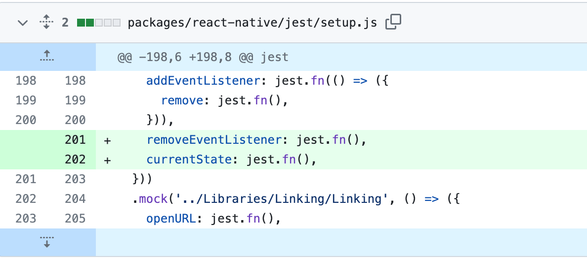

### 问题记录

背景：通过 Jest 和 React Testing Library 对 React Native 做自动化测试
问题： 代码中出现 AppState 的使用

```
import { AppState } from 'react-native';

AppState.removeEventListener('change', handleAppStateChange);

```

报错：**TypeError: import_react_native.AppState.removeEventListener is not a function**

jest.config.js 配置使用了 React Native 预设

```
module.exports = {
  preset: 'react-native',
  ...

```

经过排查发现是因为 React Native 提供的 jest mock 文件缺失部分方法

路径：*/react-native/jest/setup.js

```
  .mock('react-native/Libraries/AppState/AppState', () => ({
    addEventListener: jest.fn(() => ({
      remove: jest.fn(),
    })),
  }))
```

### 解决方案：

项目临时方案是将 packages/react-native/jest/setup.js 拷贝下来，增加 react-native/Libraries/AppState/AppState 模块的 removeEventListener 和 currentState方法的mock

```
  .mock('react-native/Libraries/AppState/AppState', () => ({
    addEventListener: jest.fn(() => ({
      remove: jest.fn(),
    })),
    removeEventListener: jest.fn(),
    currentState: jest.fn(),
  }))
```

然后放在项目仓库中在 jest.setup.js 文件头部引入

或者在 jest.config.js 的 setupFilesAfterEnv 入口引入

最后，这个缺陷我已经给 React Native 官方仓库提了[Pull Request](https://github.com/facebook/react-native/pull/39578)，已经合并主分支了

